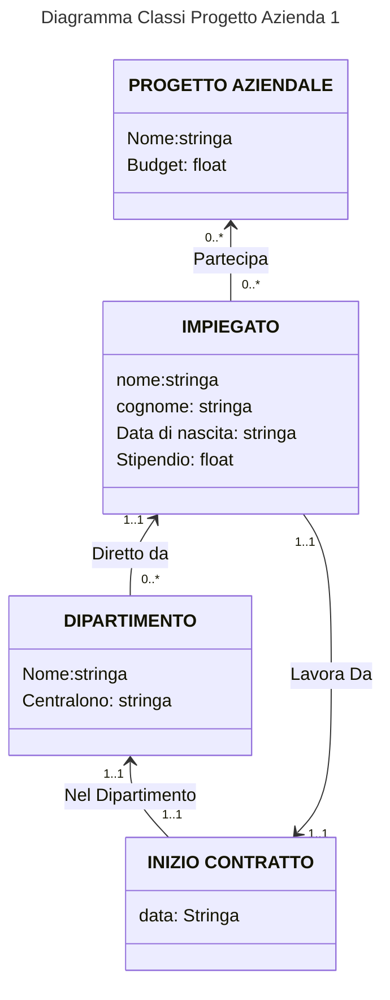
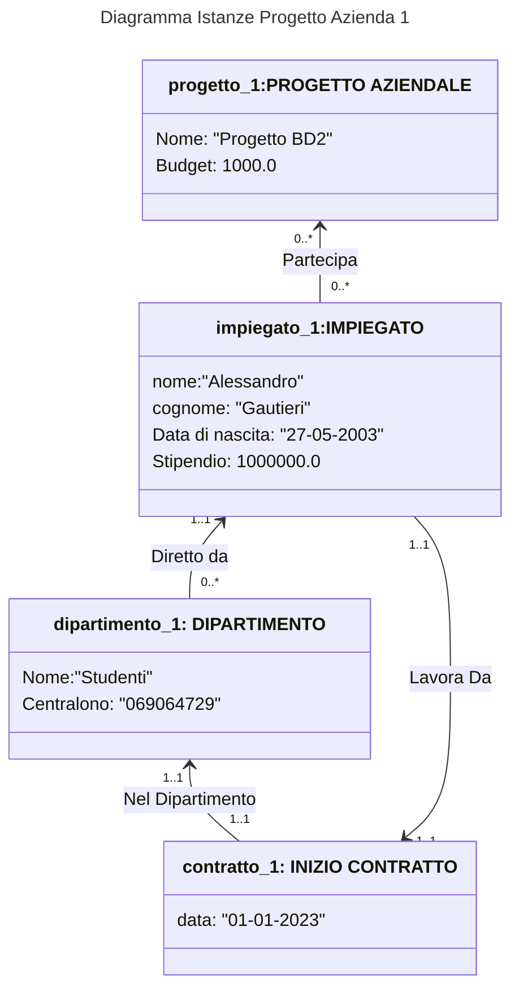

# Progetto Azienda 1  
 
## Punto 1  
Il seguente programma deve implementare la gestione degli utenti in un'azienda, implementano nel seguente modo:
 - Ogni dipendente ha un nome,cognome,data di nascita e stipendio.
 - Ogni dipendente ha iniziato a lavorare in un dipartimento in una specifica data
 - Ogni dipartimento ha un ome e un numero di centralino
 - Ogni dipendente lavora in uno o più progetti
 - Ogni progetto ha un nome e un budget  

Deve essere possibile creare un istanza di un dipendente e in una certa data assegnarlo ad un dipartimento specifico, ad ogni dipendente è associato uno e un unico dipartimento nel quale può lavorare.

Ogni dipartimento ha un Capo Dipartimento che è uno tra i dipendenti

Ogni dipendente può lavorare su uno o più progetti indipendenti dal dipartimento

## Punto 2  
 

