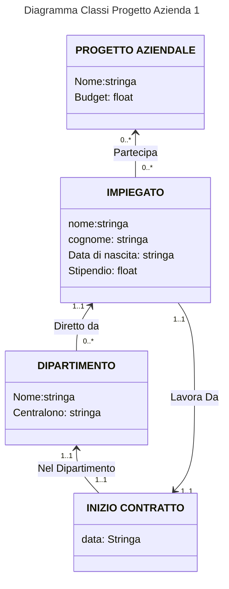
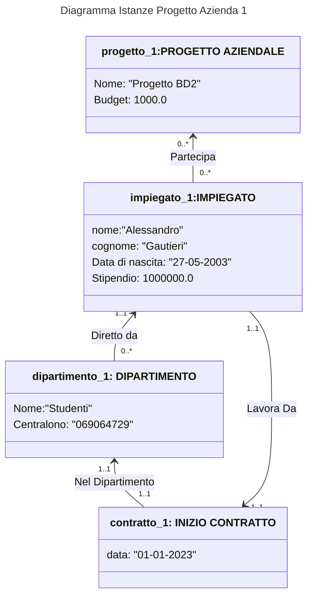

```mermaid

---
title: Diagramma Classi Progetto Azienda 1
---
classDiagram

class `IMPIEGATO`{
    nome:stringa
    cognome: stringa
    Data di nascita: stringa
    Stipendio: float
    
}
class `DIPARTIMENTO`{
    Nome:stringa
    Centralono: stringa
}
class `INIZIO CONTRATTO`{
    data: Stringa
}
class `PROGETTO AZIENDALE`{
    Nome:stringa
    Budget: float
}

`INIZIO CONTRATTO` "1..1"<-- "1..1" `IMPIEGATO`  :   Lavora Da
`DIPARTIMENTO` "1..1"<-- "1..1" `INIZIO CONTRATTO`  :   Nel Dipartimento
`IMPIEGATO` "1..1"<-- "0..*" `DIPARTIMENTO`  :   Diretto da
`PROGETTO AZIENDALE` "0..*"<-- "0..*" `IMPIEGATO`  :   Partecipa

```

```mermaid

---
title: Diagramma Istanze Progetto Azienda 1
---
classDiagram

class `impiegato_1:IMPIEGATO`{
    nome:"Alessandro"
    cognome: "Gautieri"
    Data di nascita: "27-05-2003"
    Stipendio: 1000000.0
}
class `dipartimento_1: DIPARTIMENTO`{
    Nome:"Studenti"
    Centralono: "069064729"
}
class `contratto_1: INIZIO CONTRATTO`{
    data: "01-01-2023"
}
class `progetto_1:PROGETTO AZIENDALE`{
    Nome: "Progetto BD2"
    Budget: 1000.0
}

`contratto_1: INIZIO CONTRATTO` "1..1"<-- "1..1" `impiegato_1:IMPIEGATO`  :   Lavora Da
`dipartimento_1: DIPARTIMENTO` "1..1"<-- "1..1" `contratto_1: INIZIO CONTRATTO`  :   Nel Dipartimento
`impiegato_1:IMPIEGATO` "1..1"<-- "0..*" `dipartimento_1: DIPARTIMENTO`  :   Diretto da
`progetto_1:PROGETTO AZIENDALE` "0..*"<-- "0..*" `impiegato_1:IMPIEGATO`  :   Partecipa
```